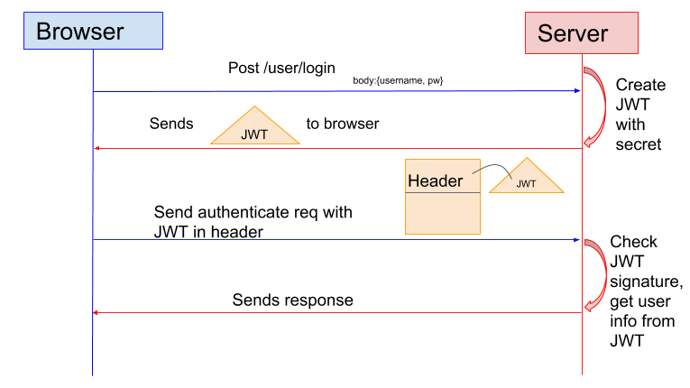

# JWT -JSON WEB TOKEN

## JWT 构成
- Header :描述 JWT 的元数据。定义了生成签名的算法以及 Token 的类型。
- Payload（负载）:用来存放实际需要传递的数据
- Signature（签名）：服务器通过Payload、Header和一个密钥(secret)使用 Header 里面指定的签名算法（默认是 HMAC SHA256）生成。

## 认证流程

1. 用户向服务器发送用户名和密码用于登陆系统。

2. 身份验证服务响应并返回了签名的 JWT，上面包含了用户是谁的内容。

3. 用户以后每次向后端发请求都在Header中带上 JWT。

4. 服务端检查 JWT 并从中获取用户相关信息。