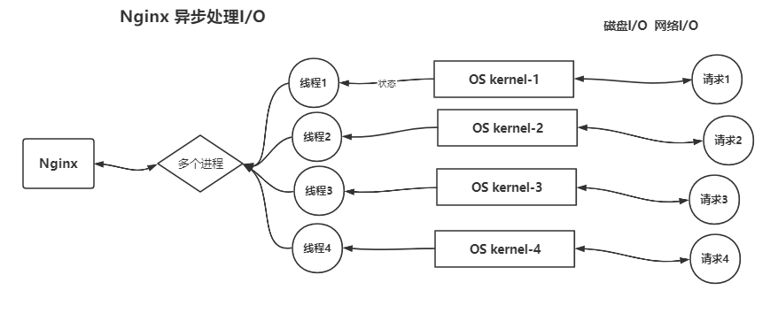

# Tengine

Tengine在Nginx基础上做了一些增强

## Tengine和Nginx

Nginx是一个高性能的**Http**和**反向代理**服务器，也是一个IMAP/IP/SMTP代理服务器。7层网络的应用

### Nginx相对于Apache的优点

- 轻量级:同样起web服务，比apache占用更少的内存及资源
- 抗并发:Nginx处理请求是`异步非阻塞`的，而apache是`阻塞型`的。在高并发下nginx能保持低资源、低能耗、高性能
- 高度模块化设计:编写模块相对简单
- 社区活跃

### Apache相比于Nginx的优点

- rewrite:URIRewrite,可以将动态的URL重写为静态的URL,静态的URI对搜索引擎更加友好
- 模块数量多:可以满足各种需求
- 稳定

### Nginx解决的问题

- 高并发
- 负载均衡
- 高可用
- 虚拟主机
- 伪静态: URLRewrite
- 动静分离

### Nginx异步处理I/O

Nginx是多进程的服务器，当面对多个I/O请求时，与内核绑定的多个进程可以生成多个线程，这些线程并不会实际处理I/O（包括网络I/O和磁盘I/O）。  
而是使用OS的内核去处理这些I/O,线程只监控I/O的状态,状态发送变化时通知线程，线程在通知Nginx。  

有两个参数:

- worker_processes: Nginx启动的服务进程数
- worker_connections: 每个服务进程可以处理的最大连接数  
  如果我想要并发处理5K个请求，我可以将`worker_processes`设置为5，`worker_connections`设置为1K。  
  但是Linux系统中设置之后是否起作用，还受限于OS
 

