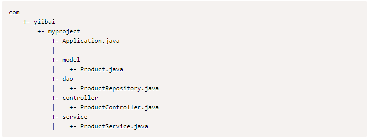
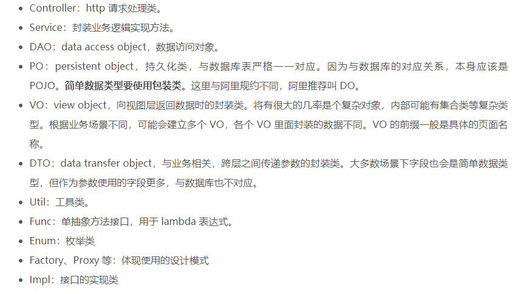
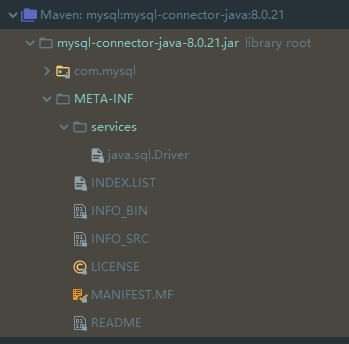

# Spring boot学习笔记
spring boot 典型布局结构

spring 包结构

## Spring boot bean和依赖注入
在Spring Boot中，可以使用Spring Framework来定义bean及其依赖注入。 @ComponentScan注释用于查找bean以及使用@Autowired注释注入的相应内容。
如果遵循Spring Boot典型布局，则无需为@ComponentScan注释指定任何参数。 所有组件类文件都自动注册到Spring Beans。

- 实体类
注解 @Entity  
通过该注解标注某个类为实体类，被标注的类会通过jpa在对应数据库中得到持久化。  
    注意:
    1. 被注解的类中的变量只能是基本类型，不能是引用类型，因为spring data jpa会将该类映射为数据库中的字段  

## 构建RESTful web服务

- 请求映射 @RequestMapping  
注释用于访问Rest端点的Request URL。可以定义Request方法来使用和生成对象。默认请求类型：get
    ```java
    
    ```
- 请求主体 @RequestBody 
注释用于请求的正文类型
    ```java
    
    ```
- 请求参数 @RequestParam 
注释 从请求URL读取的请求参数。默认情况下，参数为必须参数，还可为参数设置默认值。
    ```java
    
    ```
- 路径变量 @PathVariable
批注用于定义自定义或动态请求的URL，请求URL中的path变量定义为花括号```{}```
    ```java
    
    ```

- Service对象 @Service
这个加在Service接口的实现类中，而非Service接口上
    ```java
    
    ```

## 异常处理


## IOC 和 DI

- @AutoWried和@Resource是如何进行依赖注入的   


## Spring dataSource
- 关于Spring实体关系与数据库中表的映射问题
    1. 两张表是一对一的关系： 
        如：一条借阅记录对应一本书
    
- 关于Spring dataSource的配置问题
    ```yaml
      datasource:
        url: jdbc:mysql://127.0.0.1:3306/my_program?tinyInt1isBit=false&useUnicode=true&characterEncoding=UTF-8&allowMultiQueries=true&serverTimezone=GMT%2B8r&useSSL=false
        username: root
        password: root
        driver-class-name: com.mysql.cj.jdbc.Driver
    ```
    这里讲一点关于`driver-class-name`的值到底应该怎么配置  
    以mysql为例，如果我们需要连接mysql数据库，那么我们肯定要使用mysql数据库的驱动，驱动依赖如下  
    ```xml
		<!-- https://mvnrepository.com/artifact/mysql/mysql-connector-java -->
		<dependency>
			<groupId>mysql</groupId>
			<artifactId>mysql-connector-java</artifactId>
			<version>8.0.21</version>
		</dependency>
    ```
    maven会帮我们引入对应的依赖，我们去引入的依赖包中看一下关于mysql-connector的相关信息  
       
    我们可以看其中有个[java.sql.Driver]()的文件，里面就是配置了驱动的名称为`com.mysql.cj.jdbc.Driver`