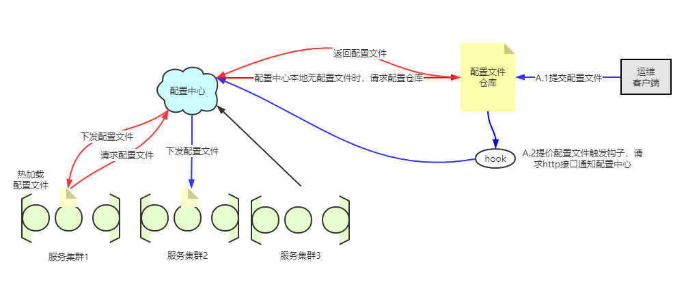

# spring cloud config(配置中心)

应用场景：假设我们现在有一个微服务集群，里面有多个服务集群。如果我们改了某个服务的配置文件， 要想使其生效，需要手动把每个服务节点上的配置文件替换，重新启动。服务集群越多，节点越多工作量越大。 所以我们可以配置一个服务来做`配置中心`。

## 配置中心

配置中心其实就是自动帮我们完成替换配置文件，然后进行服务热加载的过程。  

配置中心可以视作一个微服务，只不过这个微服务是为其他微服务提供公用服务的。 所以我们会把配置中心当作一个服务向eureka注册一下。其他的服务如果想通过配置中心来做到配置更新的话，那么必须
要知道去哪里找这个配置中心，也就是说配置中心必须要提供一个地址来供其他服务方法。 而其他服务也要配置上这个地址，当然既然配置中心已经注册为微服务了，我们也可以通过配置让eureka来帮我们定位，
这样在配置中心的地址即使发生了改变，只要他在eureka上注册了，其他服务还是可以访问到的。

## 实战

### 准备：

1.创建一个项目作为配置中心  
2.创建一个git仓库作为配置文件的远程仓库。

### 依赖

我们需要引入`spring-cloud-config-server`和`spring-cloud-starter-netflix-erueka`的两个依赖 依赖如下：

```xml
  <dependencies>
  
        <dependency>
            <groupId>org.springframework.cloud</groupId>
            <artifactId>spring-cloud-config-server</artifactId>
        </dependency>
        <dependency>
            <groupId>org.springframework.cloud</groupId>
            <artifactId>spring-cloud-starter-netflix-eureka-client</artifactId>
        </dependency>
        
  </dependencies>
```

### 配置

我们需要在启动类上加上注解`@EnableConfigServer`，来告诉spring容器初始化一些配置。

```java
@SpringBootApplication
@EnableConfigServer
public class ConfigCenterApplication {

    public static void main(String[] args) {
        SpringApplication.run(ConfigCenterApplication.class, args);
    }

}
```

另外我们需要在配置文件中配置一些东西，比如说其他服务向哪个地址来请求配置文件等。

```yaml
server:
  port: 9999
eureka:
  client:
    service-url:
      defaultZone: http://erk2.com:7002/eureka
spring:
  application:
    name: config-center
  cloud:
    config:
      enabled: true
      server:
        git:
          # 仓库地址 https://github.com/chenzifeng1/config-center.git
          uri: https://github.com/chenzifeng1/config-center
          username: chengzifeng1
          password: "**********"
          # 默认时间单位 s 访问git的速度比较慢
          timeout: 15
  
```

### 手动配置热更新

1. 开启服务actuator的refresh端点，自己学习时可以全打开

```yaml
management:
  endpoints:
    web:
      exposure:
      # include: *
        include: ["refresh","health","bus-refresh"]       
```

2. 在需要使用热更新的类上加上`@RefreshScope`
3. 使用`POST`请求访问对应服务的refresh接口,不能直接用GET请求发送，测试的话可以暴露一个get请求的接口做请求转发

### 配置按照服务更新

上面的是针对某个服务节点进行，我们在某个服务的实例节点上请求`/actuator/refresh`可以实现该节点的服务热更新。
但是，如果一个比较大的、有较多的服务节点服务，那我们一个个的去刷新节点的明显不合适。所以需要一种手段来帮我们按照服务 统一把所有节点的配置文件进行热加载。

- Spring Cloud Bus（消息总线）: 我们可以使用消息总线来解决一次更新多个服务节点的配置文件的问题。Spring cloud bus通过轻量消息
  代理连接各个分布的节点。这会用在广播状态的变化（例如配置变化）或者其他的消息指令。Spring bus的一个核心思想是通过分布式的启动器对 spring
  boot应用进行扩展，也可以用来建立一个多个应用之间的通信频道。目前实现的方式是用AMQP消息代理作为通道。

Spring Cloud Bus实际上是利用了MQ广播机制在分布式系统中传播消息，目前常用的方式是Kafka和RabbitMQ，在这个项目中我们先使用RabbitMQ来完成这一功能。
配置RabbitMQ可以见[RabbitMQ](RabbitMQ.md)

我们还需要在config-center的服务端和客户端（微服务）加入以下依赖

```xml
<dependency>
    <groupId>org.springframework.cloud</groupId>
    <artifactId>spring-cloud-starter-bus-amqp</artifactId>
</dependency>
```

另外config-center的服务端还需要开启actuator的bus-refresh端点,配置方法见上文

执行： 当我们更新了远程仓库的配置之后，配置中心在访问对应的配置文件时会去远程仓库进行拉取。之后我们需要用`POST`请求访问
[http://config-center:port/actuator/bus-refresh](),来刷新服务配置文件。

