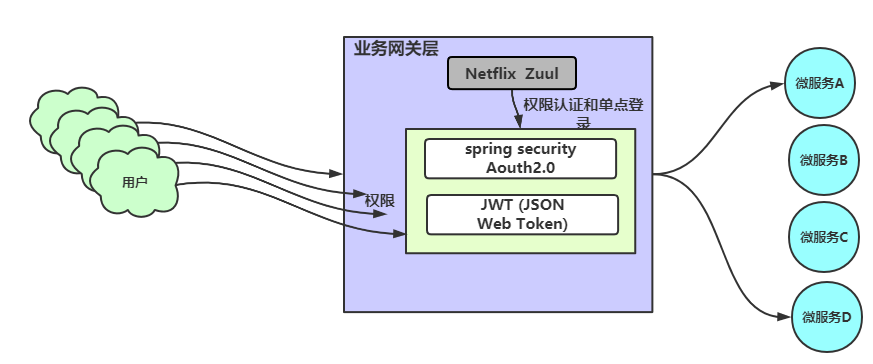

# 业务网关 - Zuul
网关作为外部请求和内网服务中间的一个隔离层，它对外提供接口，接受所有外部请求，然后将这些请求进行过滤。
合法的请求会被路由到微服务，进行服务的调用。  
我们使用zuul来实现业务网关的功能：  

## 核心组件
Zuul的核心组件就是各种过滤器，基本的过滤器有四种：PRE，ROUTE，POST,ERROR
 * **PRE**:接收到请求需要做的操作，在这种过滤器中，我们可以做鉴权，流量分发，记录调试信息等  
    1.鉴权：我认为是身份认证，由于zuul作为网关，将内网服务与外网请求进行隔离，因此不允许所有请求都打到内网服务上。  
      鉴权是判断外部请求是否合法，比如是否来自白名单内的IP，或者是否携带令牌token等  
    2.流量分发：请求打过来时，如果我们有多个服务节点可以为本次请求提供服务，那么我们需要选择一个合适的服务节点来提供服务。可以理解为负载均衡  
    3.记录调试信息：这个大概可以记录一下请求的信息
 * **ROUTE**:该过滤器完成从请求到微服务的路由，路由是指根据服务名（serviceId）来找到对应的服务名的服务节点列表，然后选择一个节点。
       路由可以认为是解析服务名，获取服务节点的ip:port/资源信息。并且构建发送给微服务的请求，使用Apache HttpClient或者Netflix Ribbon来完成请求发送
 * **POST**:这种过滤器在路由到微服务以后执行。这种过滤器可用来为响应添加标准的HTTP Header、收集统计信息和指标、将响应从微服务发送给客户端等。
 * **ERROR**:在其他阶段发生错误时执行该过滤器。