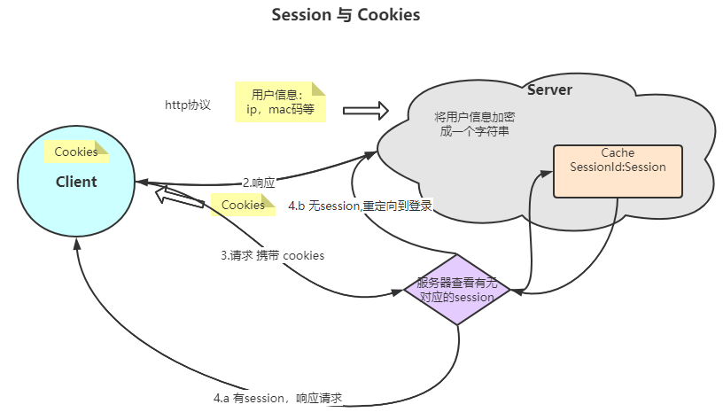

# 会话管理

## 跨域

1. 同源策略
2. 跨域解决方式：
    1. jsonp(古老的方式，使用前端回调本地js方法完成)、
    2. 浏览器设置(允许跨域之后，使用ajax做异步请求处理)
    3. 后端声明

## Session/cookies/token

session与cookies是服务器与客户端为保持连接状态采用的方法，因为http/https协议是无状态的协议， 也就是服务器没法通过http协议本身来确定一个用户当前的状态，那么对于用户的每个http请求都来做鉴权肯定不行的，
于是client(browser)与服务器进行约定: 当用户User登录，向服务器发起一个http请求，服务器接到请求之后，
会记录一下用户的信息，服务器会将这些信息一种编码（也有可能是加密）的方式产出一个session的字符串放在服务器的缓存中，
同时在给client响应的时候会带着一个cookies这个字符串缓存到browser中。以下是自己理解的画图，可能有错误，以后会修正

## SSO （Single Sign On）

单点登录，需求介绍:对于用户来说，不想在登录不同子系统时重复进行登录认证操作，想要完成一次登录，处处使用

1. Session同步，一个服务获取用户信息生成Session和Cookies之后，将Session同步到其他服务上，
   这样对于Cookies的作用域就是所有共享Session的服务。缺点：服务器的压力比较大，需要对其他服务完成复制同步，另外同步可能会有延时。
2. Session共享，
3. 统一网关，网关自己解决鉴权-> Oauth 网关将鉴权请求到统一做鉴权的服务器上-> CAS

### Oauth

思想： 有第三方应用想获取我系统的接口或者数据，那么这其中就涉及到了几个问题：

1. 如何给第三方应用权限:   
   第三方系统想获取用户的权限，我们肯定不能把用户的账户密码告诉第三方，也就是不能让第三方以账户密码的形式登录后获取接口数据，这样太不安全，
   而且对第三方用户的权限也不方便控制。比如我想让第三方用户无法访问某个接口，如果把用户的账号密码告诉了第三方，那么用户也无法访问接口了。 所以这里我们给第三方用户一个令牌`Token`
   ,第三方系统携带这个令牌来请求我们系统，这样的话，我们只需要对令牌来做鉴权即可。
2. 给一个什么样的权限  
   这个权限最好是有时间限制，在时间限制内，第三方系统可以持有令牌访问系统，过了时间之后需要重新授权，另外这个授权是需要用户同意的。

授权机制：

1. 第三方申请授权
2. 用户同意授权
3. 系统给第三方权限令牌
4. 第三方持有令牌访问

密码与令牌的差异： 密码和令牌的作用是一样的，都是给使用者进行认证鉴权。但是两者有一些不同:

1. 有效期:密码的有效期是长期有效，只要用户不主动更改，密码就一直有效。而令牌一般是有时效的，过了时间就失效了
2. 令牌可以被系统撤销，主动失效
3. 令牌一般有权限范围，可能只针对对应接口有权限。另外只读令牌比读写令牌对系统的安全性更高。

OAuth 2.0 规定了四种获得令牌的流程。你可以选择最适合自己的那一种，向第三方应用颁发令牌

- 授权码（authorization-code）
- 隐藏式（implicit）
- 密码式（password）
- 客户端凭证（client credentials）

### CAS

### OpenId

### CSRF与XSS攻击

- CSRF（Cross-site request forgery）跨站请求伪造:
- XSS: 跨站脚本攻击
