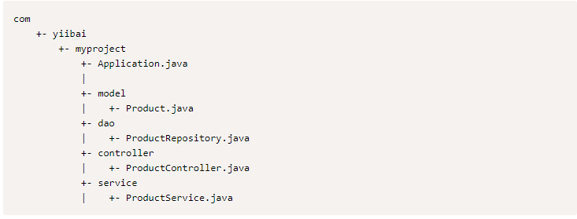

# Spring boot学习笔记
spring boot 典型布局结构

## Spring boot bean和依赖注入
在Spring Boot中，可以使用Spring Framework来定义bean及其依赖注入。 @ComponentScan注释用于查找bean以及使用@Autowired注释注入的相应内容。
如果遵循Spring Boot典型布局，则无需为@ComponentScan注释指定任何参数。 所有组件类文件都自动注册到Spring Beans。

## 实体类
注解 @Entity  
通过该注解标注某个类为实体类，被标注的类会通过jpa在对应数据库中得到持久化。  
### 注意
1. 被注解的类中的变量只能是基本类型，不能是引用类型，因为spring data jpa会将该类映射为数据库中的字段  

## 构建RESTful web服务

#### 请求映射 @RequestMapping  
注释用于访问Rest端点的Request URL。可以定义Request方法来使用和生成对象。默认请求类型：get
```java

```
#### 请求主体 @RequestBody 
注释用于请求的正文类型
```java

```
#### 请求参数 @RequestParam 
注释 从请求URL读取的请求参数。默认情况下，参数为必须参数，还可为参数设置默认值。
```java

```
#### 路径变量 @PathVariable
批注用于定义自定义或动态请求的URL，请求URL中的path变量定义为花括号```{}```
```java

```

## 异常处理
