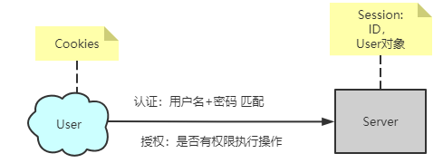
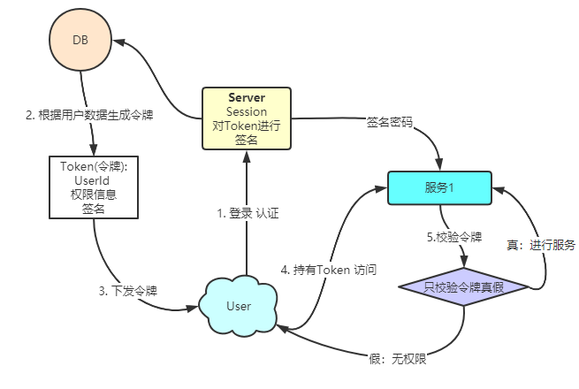

## SSO

### 有状态的会话

单节点登陆时，服务端生成Session,客户端持有Cookies,每次进行访问的时候， 用户带着Cookies进行访问，通过比较Cookies中的SessionId与服务器中的Session对象来确定用户身份。
Session中还可以保存用户的身份信息（Session可以看作是一个Map），可以将User对象保存到Session中。

### 无状态的会话

JWT

### Session共享

关于session共享的方式有多种:

- 通过nginx的ip_hash，根据ip将请求分配到对应的服务器（但是需要散列算法比较合理，不然可能造成流量倾斜）
- 基于关系型数据库存储
- 基于cookie存储
- 服务器内置的session复制域 (服务之间做Session复制，但是成本比较高，数据一致性也难以保证)
- 基于nosql（memcache、redis都可以）

本项目主要学习使用Spring boot + Redis + Spring Session 来完成session共享
实现原理：在所有请求打到服务之前设置一个过滤器，该过滤器主要功能就是拿着请求携带的SessionId去redis中找是否有对应的SessionId,对比成功则继续访问，否则就返回。

